# Jardiel

**Framework:** Svelte JS  
**Module:** Module 2 – AdDU Alumni & Admin Web Application  
**AI Tool Used:** Claude AI (claude.ai)

---

## 📌 Description

A web application for the **Ateneo de Davao University (AdDU) Alumni Association**, built with **Svelte JS** and **Vite**. The application has two separate portals:

- 🎓 **Alumni Portal** – For graduates to log in, browse events, connect with other alumni, access mentorship, and manage their profile.
- 🛡️ **Admin Portal** – For authorized staff to manage alumni verifications, create events, and view system analytics and reports.

---

## 🌐 Pages Overview

### Alumni Portal
| Route | Page |
|---|---|
| `/` or `/login` | Login Screen |
| `/dashboard` | Home Dashboard (Feed, Events, Quick Actions) |
| `/directory` | Alumni Directory (Search & Connect) |
| `/events` | Events Page (Featured + Upcoming) |
| `/profile` | Alumni Profile (Experience, Education, Skills) |
| `/mentorship` | Mentorship Hub |
| `/verify` | Alumni Registration / Verification (3 steps) |

### Admin Portal
| Route | Page |
|---|---|
| `/admin` | Admin Login |
| `/admin/dashboard` | Admin Command Center (Stats, Actions, Logs) |
| `/admin/verification` | Verification Queue (Approve / Reject) |
| `/admin/events` | Event Management (Create & Track) |
| `/admin/reports` | Reports & Analytics |

---

## 🚀 Installation – How to Run This Project

### ✅ Requirements
- **Node.js** v18 or higher → [Download here](https://nodejs.org)
- **Git** → [Download here](https://git-scm.com)
- A terminal / command prompt

---

### Step 1 – Clone the Repository

```bash
git clone https://github.com/Kjardielschool/firstattempt2026_jardiel
```

---

### Step 2 – Navigate Into the Project Folder

```bash
cd firstattempt2026_jardiel
```

---

### Step 3 – Install All Dependencies

```bash
npm install
```

This will install Svelte, Vite, svelte-routing, and all other packages listed in `package.json`.

---

### Step 4 – Run the Development Server

```bash
npm run dev
```

You will see output like:

```
  VITE v8.x  ready in XXX ms

  ➜  Local:   http://localhost:5173/
```

---

### Step 5 – Open in Your Browser

| Portal | URL |
|---|---|
| 🎓 Alumni Login | http://localhost:5173/ |
| 🛡️ Admin Login | http://localhost:5173/admin |

**Default credentials (demo — no real auth):**  
Enter any email + password → you will be redirected to the dashboard.

---

### Step 6 – Build for Production (Optional)

```bash
npm run build
```

Output will be in the `dist/` folder.

---

## 🤖 AI Tool Used

**Claude AI** – [claude.ai](https://claude.ai)  
Model: Claude Sonnet (claude.ai web interface)

---

## 💬 Prompts Used

### First Prompt
> "I am building a Svelte JS web application for an AdDU Alumni system using svelte-routing. I have design mockups for an Alumni Portal (Login, Dashboard, Directory, Events, Profile, Mentorship, Verification) and an Admin Portal (Dashboard, Verification Queue, Event Management, Reports). Can you help me build the entire project step by step?"

### Key Prompt That Generated the Full Project
> "I am building a Svelte JS web application for the AdDU (Ateneo de Davao University) Alumni Association using svelte-routing for navigation. Build me the complete [PAGE NAME] page with these features: [description of features from design]. Use navy blue #1a237e as the primary color and gold #ffd700 as the accent. All navigation should use the navigate() function from svelte-routing. Write it as a single .svelte file with <script>, HTML template, and <style> sections. Match the mobile-first layout of the design mockup."

---

## 📸 Screenshots

### Alumni Login
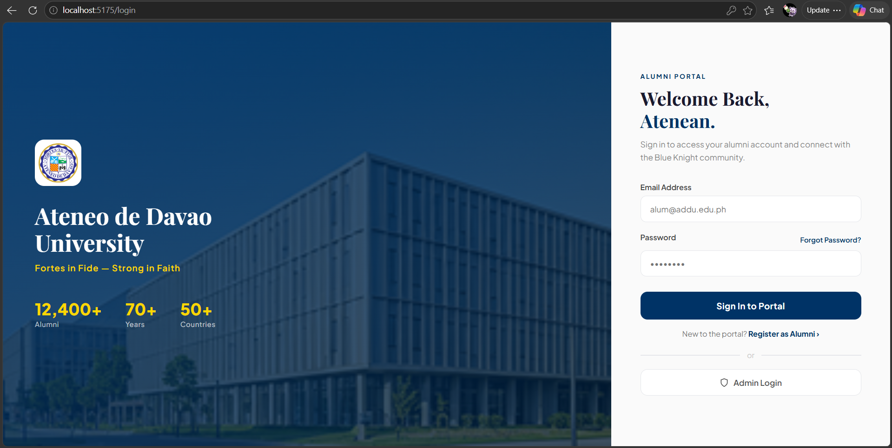

### Home Dashboard
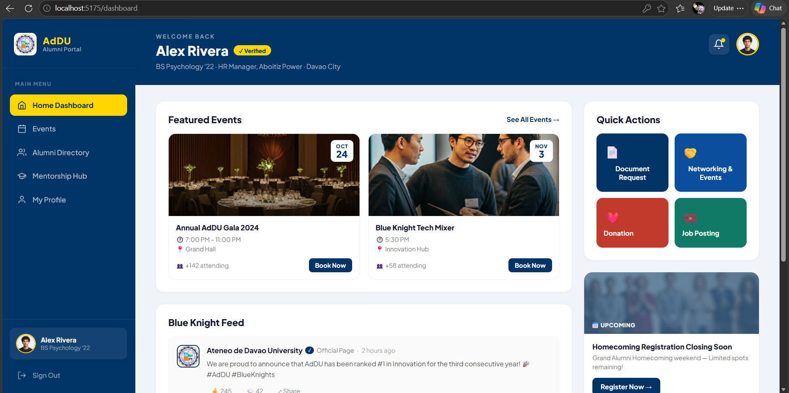

### Alumni Directory
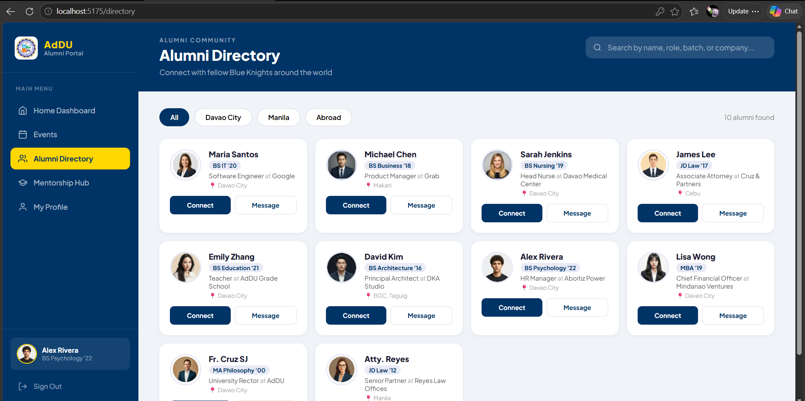

### Events Page
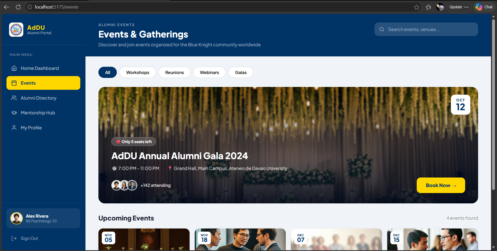

### Alumni Profile
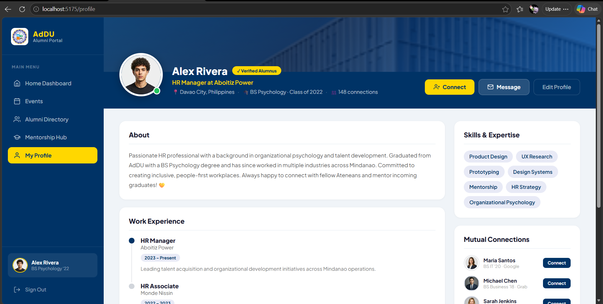

### Mentorship Hub
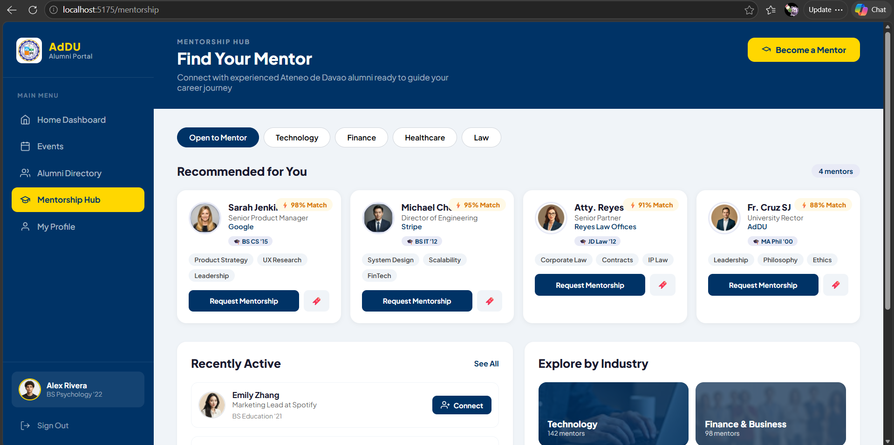

### Alumni Verification (Registration)
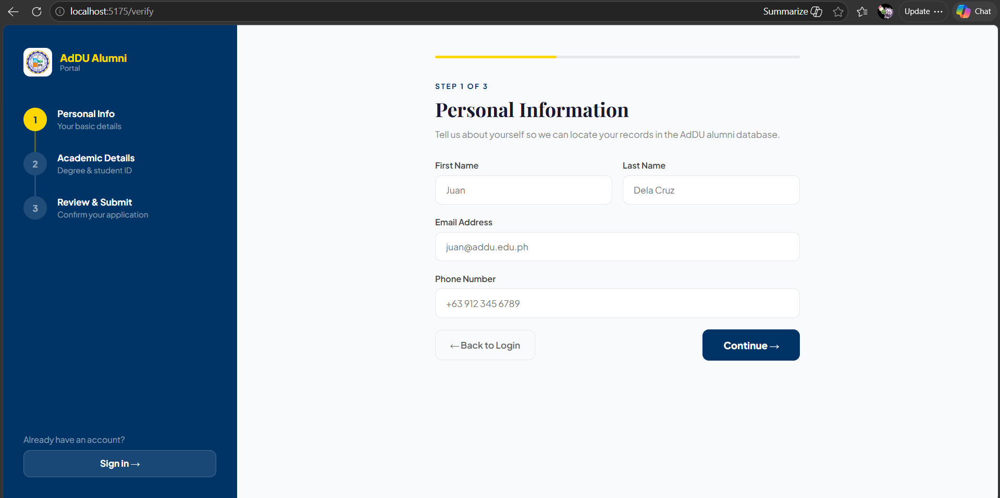

### Admin Login
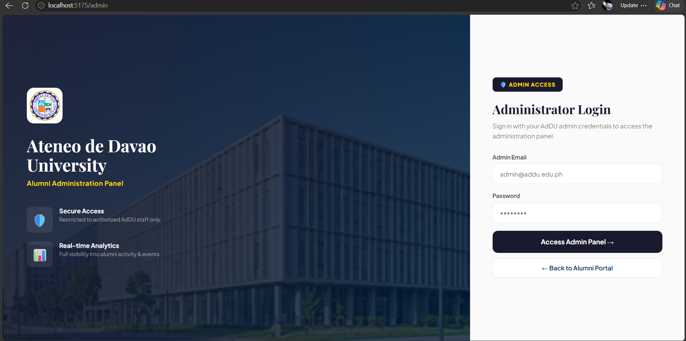

### Admin Command Center
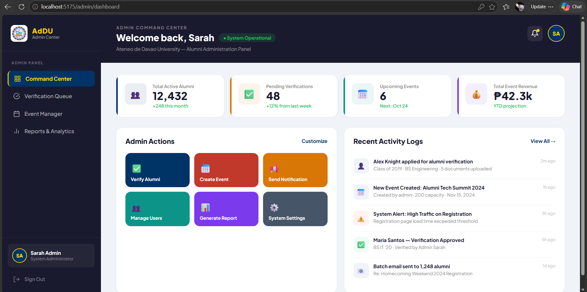

### Admin Verification Queue
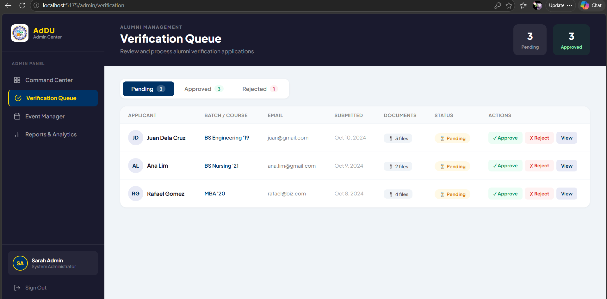

### Admin Event Manager
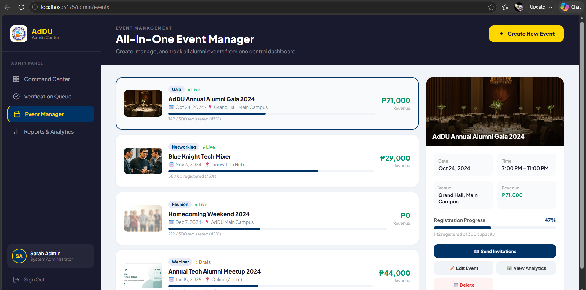

### Admin Reports & Analytics
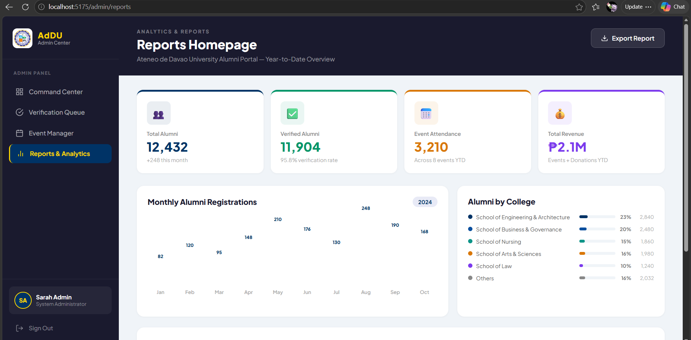

---

## 🛠️ Tech Stack

| Tool | Purpose |
|---|---|
| [Svelte](https://svelte.dev) | UI Framework |
| [Vite](https://vitejs.dev) | Build Tool & Dev Server |
| [svelte-routing](https://github.com/EmilTholin/svelte-routing) | Client-side Routing |
| HTML5 + CSS3 | Markup & Styling |
| Vanilla JavaScript | Logic |

---

## 📁 Project Structure

```
src/
├── App.svelte                  ← Root component with all routes
├── main.js                     ← Entry point
├── components/
│   ├── AlumniNav.svelte        ← Bottom navigation (Alumni)
│   └── AdminNav.svelte         ← Bottom navigation (Admin)
└── pages/
    ├── alumni/
    │   ├── Login.svelte
    │   ├── Dashboard.svelte
    │   ├── Directory.svelte
    │   ├── Events.svelte
    │   ├── Profile.svelte
    │   ├── Mentorship.svelte
    │   └── Verify.svelte
    └── admin/
        ├── AdminLogin.svelte
        ├── AdminDashboard.svelte
        ├── AdminVerification.svelte
        ├── AdminEvents.svelte
        └── AdminReports.svelte
```
